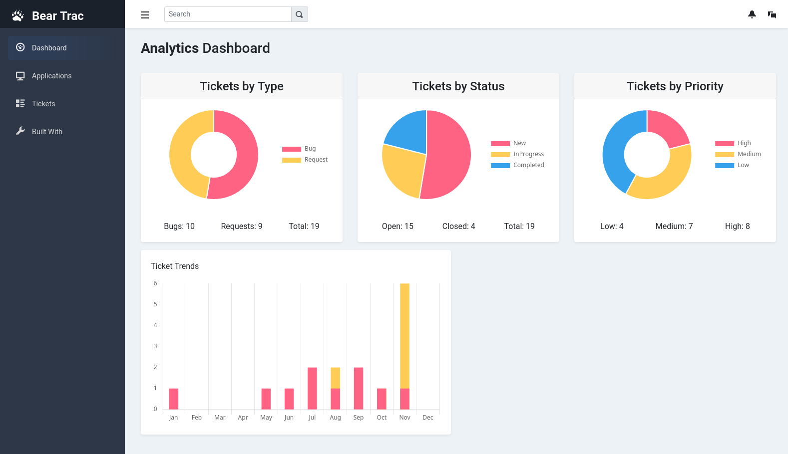
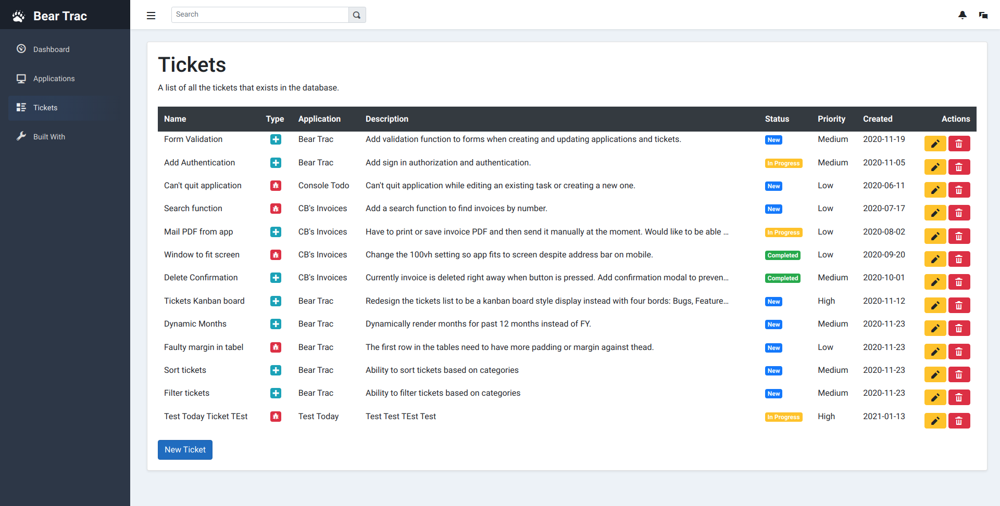
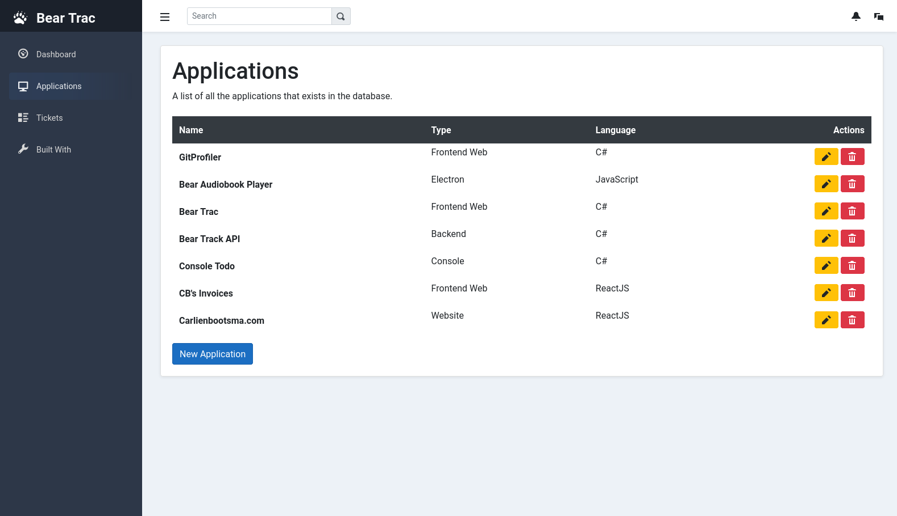
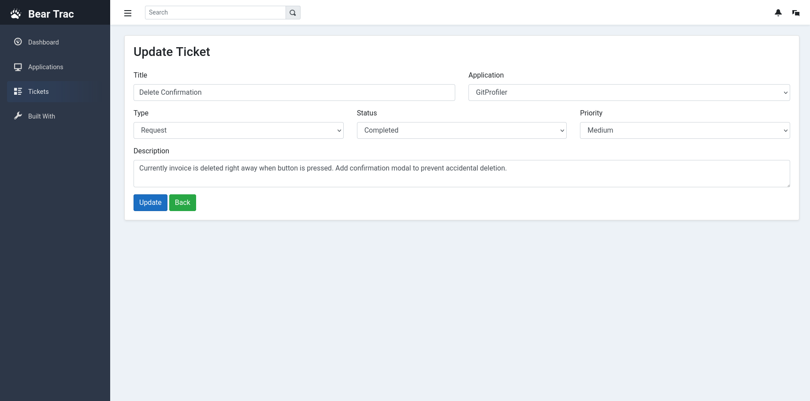
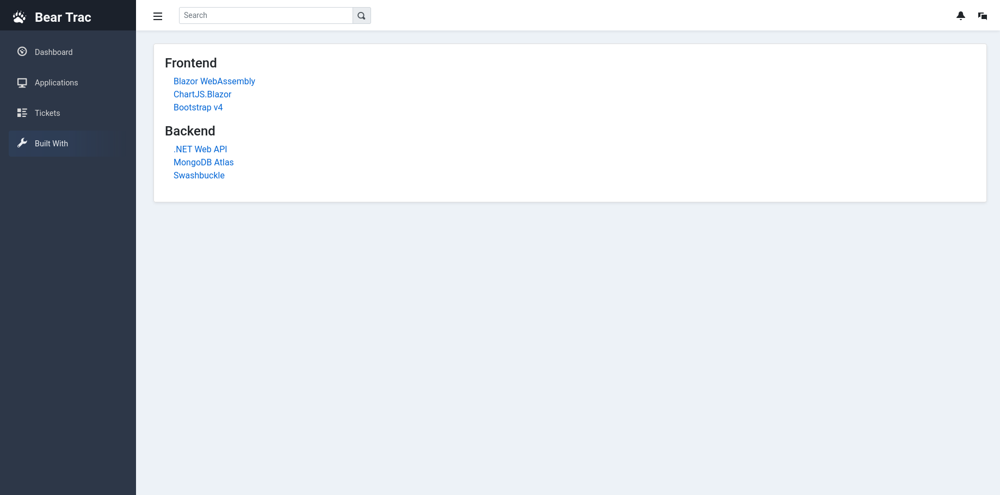
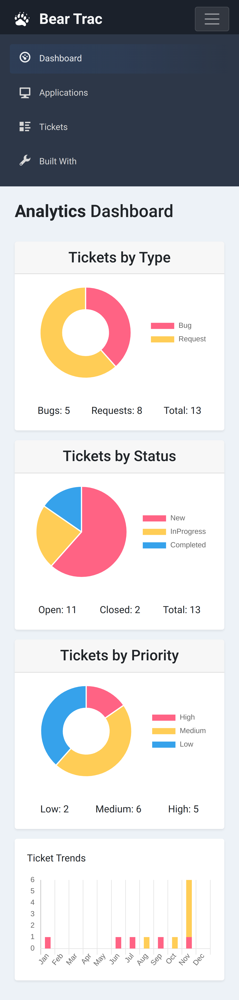

# Blazor Bear Trac

The frontend for my Bear Trac application built with .NET Blazor WebAssembly.

## Project Description

Bear Trac is a bug and feature tracker for the applications I build. The scope of this project is to learn how to perform CRUD operations against a decoupled backend with .NET Blazor, and not to replace one of the many great solutions that are already out there.

## Screenshots

#### Desktop

#### Mobile

